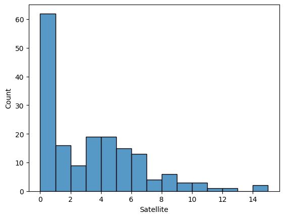

# Modeling Count Data with Poisson Regression


## How to do the regression?
---
We model the count data as

<center>
\(
\begin{align*}
\hat{y}_{i} = \exp(X_{i} \cdot \beta) \tag{1}
\end{align*}
\)
</center>


## How to optimize?
---
We need to find the best $\beta$, thus we maximize the likelihood function.
The count data can be generalized with the Poisson distribution, hence

<center>
\(
\begin{align*}
\mathcal{L}(\beta) 
&=\prod_{i=1}^{n} 
    PMF(y_{i} | X_{i}) \\
&=\prod_{i=1}^{n} 
    \cfrac
    {\exp(-\hat{y}_{i}) . \hat{y}_{i}^{y_{i}}}
    {y_{i}!}
\end{align*}
\)
</center>

It's hard to optimize the $\prod$ operation, thus we $\ln$ it.

<center>
\(
\begin{align*}
-\ln (\mathcal{L}(\beta) )
&= -\sum_{i=1}^{n}
    \left (
        - \hat{y}_{i} + y_{i} . \ln \lambda_{i} - \ln (y_{i}!)
    \right )\\
\text{nll} (\beta)
&= \sum_{i=1}^{n}
    \left (
        \hat{y}_{i} - y_{i} . X_{i} . \beta - \ln (y_{i}!)
    \right )
    \tag{2}
\end{align*}
\)
</center>

Our objective is to **minimize** the **negative log likelihood**, $\text{nll}(\beta)$
Taking the derivative of $\text{nll}(\beta)$ with respect to $\beta$ we get

<center>
\(
\begin{align*}
\cfrac{\partial \ \text{nll}(\beta)}{\partial \beta} 
&= \sum_{i=1}^{n}
    \left (
        X_{i} \exp(X_{i}\beta) - y_{i}X_{i}
    \right ) \\
&= \sum_{i=1}^{n}
    \left (
        \hat{y}_{i} - y_{i}
    \right ) X_{i} \tag{3}
\end{align*}
\)
</center>

We need to optimize Eq. (3) iteratively with **Gradient Descent**

## Build Functions
---

### Function to predict the count
---
We model the count data as

<center>
\(
\begin{align*}
\hat{y}_{i} = \exp(X_{i} \cdot \beta) \tag{1}
\end{align*}
\)
</center>

```{ .python .annotate linenums='1'}
def predict(X, beta):
    '''Function to predict the count. Eq (1)'''
    return np.exp(np.dot(X, beta)) # (1)
```

1. We do the vectorized operations of $X$ and $\beta$. This functions will return an array with shape of `(n_samples,)`

### Function to calculate the negative log likelihood
---
We calculate the model performance by the negative log likelihood

<center>
\(
\begin{align*}
\text{nll} (\beta)
&= \sum_{i=1}^{n}
    \left (
        \hat{y}_{i} - y_{i} . X_{i} . \beta - \ln (y_{i}!)
    \right )
    \tag{2}
\end{align*}
\)
</center>

```{ .python .annotate linenums='1'}
def get_nnl(y_true, y_pred):
    '''Get the log likelihood'''
    # Get y!
    y_log_fact = np.array([np.math.factorial(val) for val in y_true]) # (1)

    # Get log likelihood
    nnl = np.sum(
        y_pred - y_true*np.log(y_pred) + y_log_fact  # (2)
    )

    return nnl
```

1. There is no broadcasting for factorial function thus we use `np.math.factorial(val)` and list comprehension to calculate $\ln (y_{i}!)$
2. We know that $\hat{y}_{i} = \exp(X_{i} \beta)$, then $X_{i} \beta = \ln (\hat{y}_{i})$

## Modeling Example - Horseshoe Crab
---

We want to model the count of Horseshoe crab satellites. We get the data from [here](https://users.stat.ufl.edu/~aa/cda/data.html).

```{ .python .annotate linenums='1'}
# Run this first
import pandas as pd
import numpy as np

import matplotlib.pyplot as plt
import seaborn as sns
%matplotlib inline
```

### Load the data
---
Save the data to an excel format, then load the data
```{ .python .annotate linenums='1'}
# Create a function to read data
def read_data(fname):
    """Function to read excel data & return as Pandas DataFrame"""
    data = pd.read_excel(fname)
    print('Data shape:', data.shape)
    
    return data

# Read the data
data = read_data(fname = 'horseshoe crab.xlsx')
print(data.head())
```
``` 
Data shape: (173, 5)
   Color  Spine  Width  Weight  Satellite
0      2      3   28.3    3.05          8
1      3      3   26.0    2.60          4
2      3      3   25.6    2.15          0
3      4      2   21.0    1.85          0
4      2      3   29.0    3.00          1
```

There are 173 number of samples with 5 columns.

### What we want to predict
---
We predict the count of `Satellite` in Horseshoe crabs.

```{ .python .annotate linenums='1'}
# Create a function to read data
sns.histplot(x = 'Satellite',
             bins = 15,
             data = data)
plt.show();
```


### Split input & output data
---
First, create a function to split input & output

```{ .python .annotate linenums='1'}
# Split data
def split_input_output(data, input_cols, target_col):
    """Split input-output"""
    X = data[input_cols]
    y = data[target_col]

    print('X shape:', X.shape)
    print('y shape:', y.shape)
    return X, y

# Split data
X, y = split_input_output(data = data,
                          input_cols = ['Width'], # (1)
                          target_col = 'Satellite')
```

1. For simplicity, we only choose one prediction, i.e. `Width`

```
X shape: (173, 1)
y shape: (173,)
```

Print the splitting results
```{ .python .annotate linenums='1'}
print(X.head())
```
```
   Width
0   28.3
1   26.0
2   25.6
3   21.0
4   29.0
```
```{ .python .annotate linenums='1'}
print(y.head())
```
```
0    8
1    4
2    0
3    0
4    1
Name: Satellite, dtype: int64
```

### Prepare for the optimization
---
We want to optimize $\beta$.
Recall the Equation (1)

<center>
\(
\begin{align*}
\hat{y}_{i} &= \exp(X_{i} \cdot \beta) \tag{1} \\
\end{align*}
\)
</center>

In a vectorized form, we have

<center>
\(
\begin{align*}
\begin{bmatrix}
\hat{y}_{1}\\ 
\hat{y}_{2}\\ 
\vdots\\
\hat{y}_{n}
\end{bmatrix}
&= 
\exp \left(
    \begin{bmatrix}
    \beta_{0} + \beta_{1}x_{1}\\ 
    \beta_{0} + \beta_{1}x_{2}\\ 
    \vdots\\
    \beta_{0} + \beta_{1}x_{n}
    \end{bmatrix}
\right ) \\ \\
\mathbf{\hat{y}} 
&=
\exp \left(
    \begin{bmatrix}
    1 & x_{1}\\ 
    1 & x_{2}\\ 
    \vdots & \vdots\\
    1 & x_{n}
    \end{bmatrix}
    \cdot
    \begin{bmatrix}
    \beta_{0}\\ 
    \beta_{1}
    \end{bmatrix}
\right ) \\ \\
\mathbf{\hat{y}} &= \exp (\mathbf{A} \cdot \mathbf{\beta})
\end{align*}
\)
</center>

We have to recreate $\mathbf{A}$ first,
```{ .python .annotate linenums='1'}
# Extract data shape
n = X.shape[0]
print(n)
```
```
173
```
```{ .python .annotate linenums='1'}
# Create design matrix
A = np.column_stack((np.ones(n), X))

print(A[:10])
```
```
[[ 1.  28.3]
 [ 1.  26. ]
 [ 1.  25.6]
 [ 1.  21. ]
 [ 1.  29. ]
 [ 1.  25. ]
 [ 1.  26.2]
 [ 1.  24.9]
 [ 1.  25.7]
 [ 1.  27.5]]
```

We will use $\mathbf{A}$ and $\mathbf{y}$ during the optimization process.

Next, we have to initialize the model parameters $\beta$
```{ .python .annotate linenums='1'}
# Initialize the model parameter
# [beta_0, beta_1]
beta = np.array([-y.mean(), 0.0])
print(beta)
```
```
[-2.91907514  0.        ]
```

### The Gradient Descent
---
Our objective is to **minimize** the negative log likelihood, hence we update the $\beta$:

<center>
\(
\beta^{(i+1)} := \beta^{(i)} - \text{lr} \cdot \cfrac{\partial \ \text{nll}(\beta)}{\partial \beta} \tag{4}
\)
</center>

We do this iteratively, thus

```{ .python .annotate linenums='1'}
# Do the optimization
max_iter = 500_000    # (1)
learning_rate = 5e-6  # (2)

for i in range(max_iter):
    # Find prediction
    y_pred = predict(A, beta) # (3)

    # Find likeliheood
    nll = get_log_likelihood(A, y, beta) # (4)

    # Find grad
    grads = np.dot(A.T, (y_pred - y)) # (5)

    # Update
    beta += -learning_rate * grads # (6)

    # Print
    if i%10_000==0 or i==0:
        print(f'iter:{i+1}, nll: {nll:.4f}, beta:{np.round(beta,4)}') # (7)
```


1. This is a stopping criterion. When `i == max_iter-1` the optimization process will stop.

2. `learning_rate` will control how big the changes is when updating the model parameter during optimization process. A big value of `learning_rate` can make the model parameter updates diverges.

3. Predict the count using Eq. (1)

4. Predict the negative log likelihood using Eq. (2)

5. Predict the gradient of NLL using Eq. (3). We use vectorized operation, i.e. `np.dot(A, B)`, instead of `np.sum(A * B)`.

6. Update the model parameter using Eq. (4)

7. Print the optimization process. You can monitor the NLL. There's something **wrong** if your NLL is **getting bigger**.


```
iter:1, nll: 2013.5065, beta:[-2.9166  0.0671]
iter:10001, nll: 461.7734, beta:[-2.9746  0.1519]
iter:20001, nll: 461.7201, beta:[-3.0261  0.1538]
iter:30001, nll: 461.6821, beta:[-3.0696  0.1554]
iter:40001, nll: 461.6551, beta:[-3.1063  0.1568]
iter:50001, nll: 461.6358, beta:[-3.1373  0.1579]
...
iter:450001, nll: 461.5881, beta:[-3.3046  0.164 ]
iter:460001, nll: 461.5881, beta:[-3.3046  0.164 ]
iter:470001, nll: 461.5881, beta:[-3.3046  0.164 ]
iter:480001, nll: 461.5881, beta:[-3.3046  0.164 ]
iter:490001, nll: 461.5881, beta:[-3.3047  0.164 ]
```

Finally, we get our trained model parameter $\hat{\beta}$
```{ .python .annotate linenums='1'}
# Final model parameter
print(beta)
```
```
[-3.30467683  0.16404214]
```

### Evaluation
---
Let's check its performance. First, we make a prediction

```{ .python .annotate linenums='1'}
# Create a prediction
y_pred = predict(A, beta)

print(y_pred)
```

``` py
[3.81032936 2.61279026 2.44685093 1.15051312 4.2739785  2.21749145
 2.6999335  2.18141199 2.48732062 3.34170756 2.65600451 4.20443917
 ...
 3.62735231 3.87335031 8.9417806  2.52845967 1.88199888 1.62368218
 3.81032936 2.83612812 2.83612812 2.65600451 2.04286965] # (1)
```

1. The results of Poisson model is not `int`

We cannot compare anything right now, let's plot the count distribution of `Satellite` between actual & predicted value.

```{ .python .annotate linenums='1'}
# Create visualization
sns.histplot(y, color='b', bins=8, alpha=0.3, label='actual')
sns.histplot(y_pred, color='r', bins=8, alpha=0.3, label='pred')

plt.legend()
plt.show();
```


Not a good prediction though.

### Modeling with Statsmodel
---
Now, let's try modeling with a well-known library: `statsmodels`

```{ .python .annotate linenums='1'}
import statsmodels.api as sm
```

Do the modeling

```{ .python .annotate linenums='1'}
# Create the object
poi_reg = sm.GLM(y, A,
                 family = sm.families.Poisson()) # (1)

# Fit the object
poi_res = poi_reg.fit()
```

1. Poisson regression is a family of GLM (generalized linear model).


Then print the results

```{ .python .annotate linenums='1'}
# Print results
print(poi_res.summary())
```
```
                 Generalized Linear Model Regression Results                  
==============================================================================
Dep. Variable:              Satellite   No. Observations:                  173
Model:                            GLM   Df Residuals:                      171
Model Family:                 Poisson   Df Model:                            1
Link Function:                    Log   Scale:                          1.0000
Method:                          IRLS   Log-Likelihood:                -461.59
Date:                Sat, 17 Jun 2023   Deviance:                       567.88
Time:                        14:28:46   Pearson chi2:                     544.
No. Iterations:                     5   Pseudo R-squ. (CS):             0.3129
Covariance Type:            nonrobust                                         
==============================================================================
                 coef    std err          z      P>|z|      [0.025      0.975]
------------------------------------------------------------------------------
const         -3.3048      0.542     -6.095      0.000      -4.368      -2.242
x1             0.1640      0.020      8.216      0.000       0.125       0.203
==============================================================================
```

As we can see, the coefficient is `[-3.3048, 0.1640]` similar to our from scratch results.

Eventhough the results is not good enough, however we can validate that our from scratch works fine compared to the `statsmodels` library.